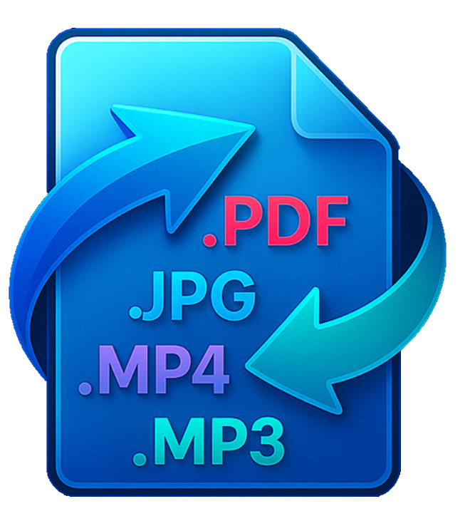
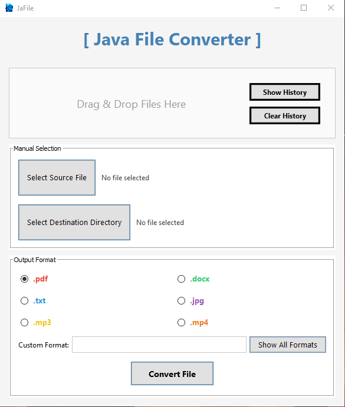
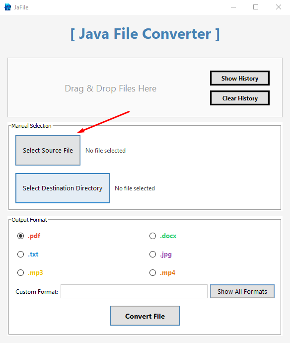
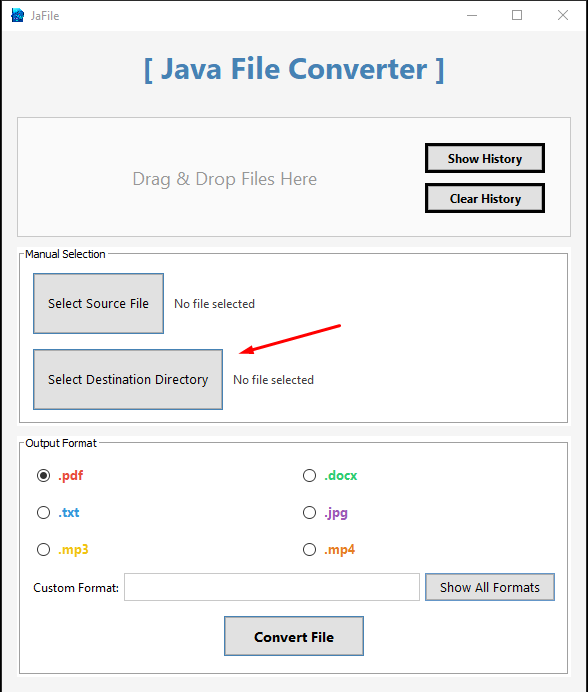
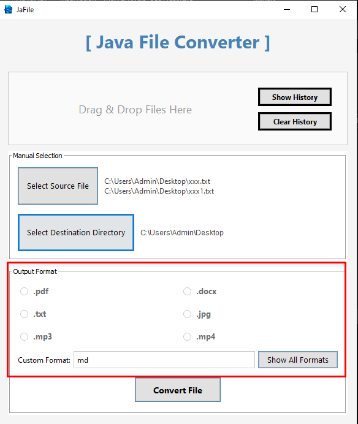
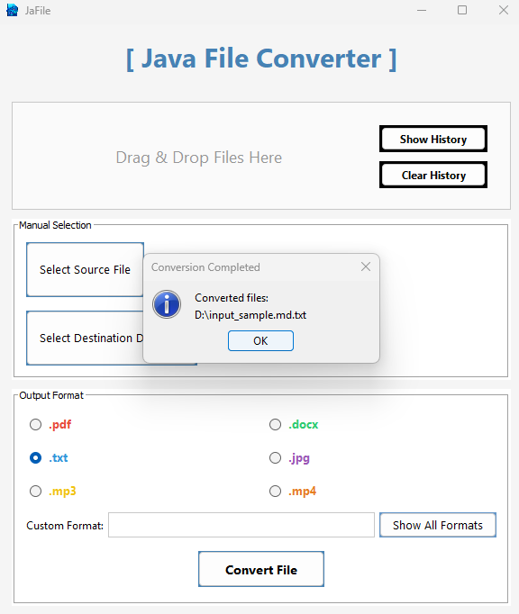
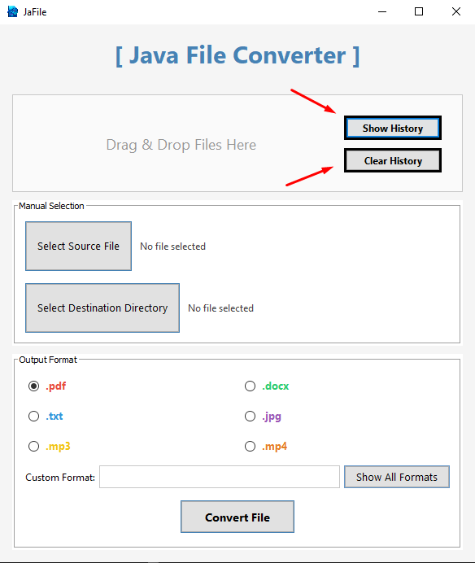

# 📁 Jafile

Welcome to our project 🎉 



This project was developed using **Java** along with **Swing** to create a simple and user-friendly graphical interface.


---


# 📝 Description
The **Jafile(Java File Converter)** is a versatile tool designed to easily transform files between a wide range of formats.  
It provides a user-friendly interface that supports the conversion of:

- 📄 **Document Formats:**  
  `pdf`, `doc`, `docx`, `odt`, `fodt`, `rtf`, `txt`, `xml`
  
- 📚 **E‑book Formats:**  
  `epub`, `fb2`
  
- 📊 **Spreadsheet Formats:**  
  `xls`, `xlsx`, `ods`, `csv`
  
- 🖼️ **Image Formats:**  
  `jpg`, `jpeg`, `png`, `bmp`, `gif`, `tiff`, `webp`, `heic`, `avif`
  
- 🎵 **Audio Formats:**  
  `mp3`, `wav`, `ogg`, `flac`, `aac`, `m4a`, `wma`, `alac`, `opus`, `amr`, `aiff`
  
- 🎬 **Video Formats:**  
  `mp4`, `mkv`, `avi`, `mov`, `flv`, `wmv`, `webm`, `mpeg`, `3gp`, `ts`, `m4v`
  
- ⚡ **Other Formats:**  
  `json`, `html`, `latex`, `markdown`


---


# 🛠 Requirements

To ensure proper file conversion across various formats, the application uses the following essential tools:

-  📄 **Pandoc** - For document and markdown file conversions. [Get Pandoc](https://github.com/jgm/pandoc/releases/tag/3.6.4)
-  🖇️ **LibreOffice** - For advanced document, spreadsheet, and presentation conversions. [Get libreoffice](https://www.libreoffice.org/download/download-libreoffice/)
-  🖼️ **ImageMagick** - For image format conversions and optimizations. [Get imagemagick](https://imagemagick.org/script/download.php)
-  🎞️ **FFmpeg** - For audio and video file format conversions. [Get ffmpeg](https://www.ffmpeg.org/download.html)
-  🐳 **Docker & Docker Compose** – Required to run the PostgreSQL database and manage pgAdmin easily via containers. [Get Docker Desktop](https://www.docker.com/products/docker-desktop/)


 ⚠️ **Important Note**  
> All of the above tools are already included in a prepackaged **compressed file** located in the [📥-installation🧰 3. Extract Tools](#-3-extract-tools) below.  
> If for any reason the tools are missing or fail to work, you can manually install them using the links provided above.
> You’ll need to manually install **Docker & Docker Compose** on your system to enable database support.  
> 👉 [Get Docker Desktop](https://www.docker.com/products/docker-desktop/)


---


# 📥 Installation

*Follow these simple steps to set up the project:*


---

### 📁 1. Choose a Folder  
Choose a folder on your machine where you'd like to store or clone the project.

---

### 🔀 2. Clone the Repository (Recommended)  
Use Git to clone the repository:
```bash
git clone https://github.com/Ahmed-Alsefari/Jafile-Java-File-Converter-.git
```


### 📦 2.1 Alternative Method (Without Git)  
If you don't want to use Git:

- Download the project files directly from [this MEGA link](https://mega.nz/folder/IXcClLjZ#irj2clmDx78-nlimcoRH8g) [Jafile-Java-File-Converter-.zip].
  
---

### 🧰 3. Extract Tools  
- Inside the [MEGA link](https://mega.nz/folder/IXcClLjZ#irj2clmDx78-nlimcoRH8g), you will find a compressed file named `Jafile.zip` !!! You’ll need to manually install **Docker & Docker Compose** !!!.
- Extract it and place the extracted "tools" and "jdk1.8.0_202" folders inside the root project directory.

---

### ☕ 4. Make Sure Java is Installed  
Check if Java is installed using the following command:
```bash
java -version
```
> ✅ Java **17 or higher** is recommended.

---

### 🛠️ 5. Open the Project  
- Open the project folder using **IntelliJ IDEA** or any Java-supported IDE.

---

### 🐳 6. Run the Database  
> ⚠️ **Important Note:**
> after install **Docker & Docker Compose** 
> run the following command inside the **IntelliJ IDEA** or any Java-supported IDE terminal:
```bash
docker-compose up
```
---

### 🚀 7. Run the GUI  
- Locate the `JavaConverter` class inside the `src` folder.
- Right-click the file and choose **Run** (or run it from the terminal if you're using another IDE).
- This will launch the main graphical interface of the application.
- Or you can directly open [Jafile-Java-File-Converter-.jar]



---

# 📚 How to Use


### 📂 1. Select Input File
Click the "Select Source File" button to choose the file you want to convert, or you can "Drag & Drop Files".
You can select multiple files at once.



---

### 💾 2. Set Output Directory (Optional)
You can optionally choose a destination folder to save the converted file by clicking "Select Destination Directory". 
If not specified, the output will be saved in the default directory.



---

### 🔄 3. Choose Output Format
Pick a format from the list (.pdf, .docx, .txt, .jpg, .mp3, .mp4), or use the Custom Format field.
You can view all formats by clicking "Show All Formats."



---

### ▶️ 4. Start Conversion
Click the "Convert File" button. The application will begin the conversion using the appropriate internal tool (Pandoc, LibreOffice, etc.).


---

### ✅ 5. View Result
Once the conversion completes, a success message will appear.



---

### 🧾 6. View & Manage History
You can click "Show History" to view a list of previously converted files.
To clear this list, click "Clear History" This will remove all stored conversion records



---


# 🤖 Use of Generative AI Tools


In the Constant class:
the Formats set was the idea of ​​AI to organize the formats

In the Tool class:
it was created using AI

In the Convert File class:
the method variables were optimized using AI. For the commands, I was given how they were supposed to be sent, and I developed them myself


In the File History class:
This class was written using AI, as it is a simple utility class

In the Database class:
the methods were corrected using AI


In the FileConvertServer:
Initially created by Ahmed, and later enhanced using AI

In the GUI class:
Designed by Ibrahim and improved in terms of layout and usability with help from AI
the clint server in GUI:
new SwingWorker the block above client and method done() under client

In the Database test:
Created using AI

In the convert test:
Initially generated by AI and later optimized by Faisal

---


# 👥 Team Members

| Name               |
|--------------------|
| Faisal Aljuaid     |
| Ahmed Alsefari     |
| Ibrahem Alshikh    |
